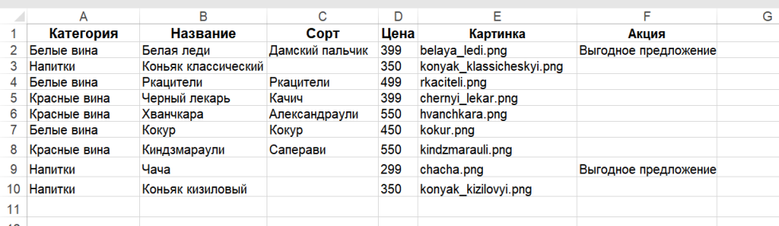

# Новое русское вино

Сайт магазина авторского вина "Новое русское вино".

## Требования

Должно быть установлены следующее ПО:

- [Python 3.x](https://www.python.org/)
- [Git](https://git-scm.com/download)

Дополнительно для Windows можно использовать:

- [GitHub Desktop](https://desktop.github.com/) &mdash; gui для git.
- [Cmdr](https://cmder.net/) &mdash; удобная замена стандартной командной строке Windows.

## Установка

Скопируйте ссылку на этот репозиторий:
```
https://github.com/OrionApplePie/dvmn_wine.git
```

В терминале выполните команду:
```
git clone https://github.com/OrionApplePie/dvmn_wine.git
```
после чего репозиторий скачается и будет доступен локально.

Далее перейдите в папку с репозиторием, и используйте `pip` (или `pip3`, есть конфликт с Python2) для установки зависимостей:
```
pip install -r requirements.txt
```

## Данные для сайта

Данные для наполнения сайта должны храниться в файле Excel (.xlsx) с именем `wine.xlsx` в папке `data` в корне проекта. [Пример файла](https://dvmn.org/filer/canonical/1610450335/764/).

Имена столбцов следующие: `Категория, Название, Сорт, Цена, Картинка, Акция`.

Пример заполнения:


Чтобы добавить новый напиток &mdash; внесите в пустой строке его категорию, название, цену и имя файла картинки. Скопируйте картинку напитка в папку `images`. Сорт и акция &mdash; не обязательные поля.

Чтобы добавить к картинке товара значок "Выгодное предложение" &mdash; внесите в строке нужного товара строку "Выгодное предложение" в столбце "Акция".

## Запуск

- Запустите сайт командой `python3 main.py`
- Перейдите на сайт по адресу [http://127.0.0.1:8000](http://127.0.0.1:8000).

## Цели проекта

Код написан в учебных целях — это урок в курсе по Python и веб-разработке на сайте [Devman](https://dvmn.org).
